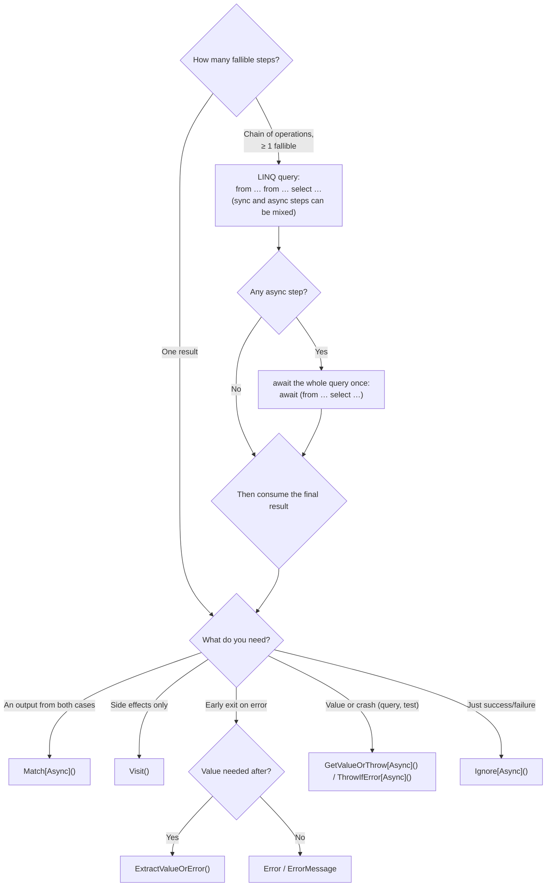

Our team at D-EDGE works on a codebase that is roughly ¾ F# – ¼ C#. On the F# side, `Result<'ok, 'error>` is everywhere: business failures flow through return values, signatures tell the truth, and no `try`/`catch` pyramid obscures the happy path. Every time we crossed back into the C# quarter, exception-based control flow felt like a regression: a method returning `RoomEntity` that may actually throw for perfectly *expected* business reasons — room not found, facility rejected — hides its failure modes from both the compiler and the reader.

So we built a `Result` type for our C# code. That much was inevitable. What was less obvious — and what this article is really about — is that the hard part was **not** the one everybody talks about.

Union types are the current buzz in the C# world: they are proposed for a future version of the language, expected to ship with .NET 11, and `Result` is the poster child of every union-type pitch. Yet in practice, the absence of union types in today's C# was a minor inconvenience. The genuine difficulty was resisting the urge to do a line-by-line port of the F# type, and instead designing an implementation and a call-site syntax that feel *native* to C#.

Here is how that went.

## Prior art: the OneOf library

We did not start from a blank page. The initial design was inspired by [OneOf](https://github.com/mcintyre321/OneOf), the well-known library that emulates union types with generic `OneOf<T0, T1, ...>` structs and `.Match`/`.Switch` methods.

OneOf validates two ideas we kept:

- a closed set of cases, consumed through an exhaustive `Match`;
- failures as values rather than exceptions.

But we deliberately diverged from it. OneOf is a *general-purpose* union emulation: `OneOf<RoomEntity, Error>` says nothing about which case is the success and which is the failure; its members are named `T0` and `T1`, and every domain-specific nicety has to be rebuilt on top. A dedicated `Result<T>` gives us domain-meaningful names (`Ok`, `Error`, `Match(ok:, error:)`), a single error contract, and — crucially — room for the ergonomic API described below, which a generic union cannot offer.

This was the first hint of the article's thesis: *union-ness* is not the source of the design difficulty.

## The elephant in the room: no union types

Let's get the famous limitation out of the way. In F#, the type is a two-line discriminated union:

```fsharp
type Result<'ok, 'error> =
    | Ok of 'ok
    | Error of 'error
```

In a future C# with union types, it could look like this:

```csharp
public sealed record Ok<T>(T Value);
public sealed record Error<T>(IError Value);

public union Result<T>(Ok<T>, Error<T>);
```

And in today's C#? An abstract record with exactly two sealed subclasses:

```csharp
public abstract record Result<T>
{
    public abstract TResult Match<TResult>(Func<T, TResult> ok, Func<IError, TResult> error);
}

public sealed record Ok<T>(T Value) : Result<T>
{
    public override TResult Match<TResult>(Func<T, TResult> ok, Func<IError, TResult> error) => ok(Value);
}

public sealed record Error<T>(IError Value) : Result<T>
{
    public override TResult Match<TResult>(Func<T, TResult> ok, Func<IError, TResult> error) => error(Value);
}
```

That's it. The hierarchy is closed in practice — `Ok<T>` and `Error<T>` are the only subclasses — and the abstract `Match` method encodes exhaustive pattern matching: you *cannot* handle one case and forget the other; the compiler makes you pass both functions.

What we lose compared to a native union is exhaustive `switch` expressions (the compiler cannot know the hierarchy is closed, so it demands a discard arm) and some pattern-matching sugar. What we keep is everything that matters: a sum type with two cases, structural equality for free thanks to records (nice in tests: `Assert.That(result, Is.EqualTo(new Error<string>(expectedError)))`), and exhaustiveness through `Match`.

When union types ship, our migration will be a handful of lines: the type *declaration* shrinks, and `Match` could give way to `switch` expressions. Everything else in this article — the actual design work — remains untouched.

So no, the missing union types were not the challenge.
The challenge starts now.

## The real challenge: design for C#, don't port F#

A naive port of F#'s `Result<'ok, 'error>` to C# produces a type that is technically correct and miserable to use. C# is not F#: no Hindley-Milner type inference, no partial application, no `|>` pipelines, no computation expressions — but implicit conversions, `out` parameters, nullability flow analysis, early exits, and LINQ. A C#-friendly `Result` should lean on the second list, not mourn the first.

Our design goal, in one sentence:

> **Flat code — no nested `if`/`switch`/`try` blocks — that still handles the Ok and Error cases exhaustively.**

Readable, yet robust.

Here are the decisions that got us there.

### Decision 1: one error type, not a second generic parameter

F#'s `Result<'ok, 'error>` is fully generic on the error side. We dropped that: our C# type is `Result<T>` with a fixed error contract.

```csharp
public interface IError
{
    string Format();
}
```

Why?

Because C# generics are a lot noisier than F# generics. In F#, inference makes `Result<RoomEntity, BookingError>` mostly invisible at call sites. In C#, a second type parameter shows up *everywhere*: every method signature, every combinator, every extension method doubles its generic arity, and the compiler frequently needs explicit type arguments where F# would infer them. The cost is permanent; the benefit — heterogeneous error types — was one we did not need.

💡 The idea of an *interface* as the error contract comes from Paul Blasucci's article [FaultReport: a Theoretical Alternative to Result](https://paul.blasuc.ci/posts/fault-report.html), where an `IFault` interface fixes the error contract while leaving its implementations open. The article is also a healthy reminder that F#'s `Result` is no panacea: a fully generic error side means no consistency across libraries, an incentive towards lazy `string` errors, and tedious plumbing when combining operations whose error types differ — limitations worth keeping in mind even on the F# side of a codebase. A minimal `IError` interface, with a standard record implementation carrying a structured-logging message template, covers all our cases:

```csharp
public sealed record BusinessError(string MessageTemplate, params object[] Args) : IError
{
    public string Format() => /* renders the template */;
}
```

☝️ This is the single biggest divergence from F#.

### Decision 2: implicit conversions as constructors

F# has no implicit conversion operators — not because it couldn't, but as a deliberate language-design choice: favor the explicit, no hidden tricks, no compiler magic.
That is a sound principle, and one worth applying in C# too — *except* when explicitness degenerates into heavy, noisy code. F# can afford to be explicit everywhere because it is a low-ceremony language by design; C# is not, so it compensates with features like implicit conversions — see Mark Seemann's [Zone of Ceremony](https://blog.ploeh.dk/2019/12/16/zone-of-ceremony/) to dig into this trade-off.

So we leaned on a feature C# does have:

```csharp
public abstract record Result<T>
{
    public static implicit operator Result<T>(T value) => new Ok<T>(value);
    public static implicit operator Result<T>(BusinessError error) => new Error<T>(error);
}
```

At call sites, results are built with no ceremony at all:

```csharp
Result<int> ok = 42;                                     // success
Result<int> error = new BusinessError("Boom {Id}", id);  // failure
```

A method returning `Result<RoomEntity>` just returns the entity on the happy path and returns a `BusinessError` on failure — no `Ok(...)` / `Error(...)` wrapping, no visual noise. This is more concise than the F# original, and only possible because we embraced a C#-specific feature rather than porting F# syntax.

☝️ A subtlety on the error side: the `Error<T>` case wraps an `IError`, yet the conversion is declared from `BusinessError`, the concrete type. That is not an oversight — C# forbids user-defined implicit conversions from an interface. So the shortcut targets the standard implementation, `BusinessError`, and any other `IError` implementation goes through the explicit `new Error<T>(error)`. In practice this is no constraint: `BusinessError` covers virtually every call site.

💡 One conversion we added and then *removed*: `string → Error`. It was a trap: with a `Result<string>`, the success payload and the error are both strings, so the two implicit conversions collide — forcing call sites to be explicit in that one case only.
A convenience that silently stops working for one payload type is unsound; better to drop it and build errors explicitly from `BusinessError` everywhere.

### Decision 3: name for C# readers, not for FP initiates

An F# port would expose `map`, `bind`, `iter`, `defaultValue`. Our C# colleagues who have never touched F# should not need a monad glossary to review a PR. So the API speaks C#:

| Member | What it evokes for a C# developer |
| --- | --- |
| `Match(ok, error)` | pattern matching, exhaustive: both functions are required |
| `Visit(ok?, error?)` | the Visitor pattern; side effects, each case optional |
| `ExtractValueOrError(out value, out error)` | the Try-pattern (`int.TryParse`, `Dictionary.TryGetValue`) |
| `GetValueOrThrow()` | "give me the value or crash loudly" — obvious at a glance |
| `Ignore()` | drop the payload, keep the outcome |
| `Map(f)` | familiar from LINQ's `Select`; kept as the one FP name that earned its place |

Three naming stories worth telling:

- `Visit` was initially named `Switch` (as in OneOf). We renamed it: `Switch` is too evocative of the language's `switch` statement and wrongly suggests exhaustiveness, while `Visit` — impure, every case optional, an omitted case is a silent no-op — is honest about what it does, and nods to a pattern every C# developer knows.
- `Bind` exists, but it is `internal`. It is the building block behind the LINQ extensions (in the next section), not a call-site API. Exposing `Bind` publicly would have invited the nested-lambda style we wanted to avoid; the query syntax is strictly more readable.
- `Ignore` is admittedly the least C#-speaking name of the list. It resonates most with F# developers, used to the `ignore` function that *explicitly* discards a value — something C# allows implicitly, but in a trap-prone way (a silently dropped return value). We kept it anyway: short, honest about its intent, and familiar to our mostly F # team.

### Decision 4: the Try-pattern bridge

`Match` is the fundamental operation, but forcing every consumer to use lambdas runs counter to a deeply ingrained C# idiom: the guard clause. C# developers exit early; they do not nest.

So the type offers a Try-pattern deconstruction, with nullability attributes so the compiler's flow analysis stays accurate on both branches:

```csharp
public bool ExtractValueOrError([MaybeNullWhen(false)] out T value, [NotNullWhen(false)] out IError? error)
```

At the call site, it reads like any `TryXxx` guard:

```csharp
if (!result.ExtractValueOrError(error: out var error, value: out var value))
{
    return Result.Fail(error); // compiler knows: error is not null here
}
// compiler knows: value is usable here
```

💡 **Tip:** pass the arguments named and in reverse order — `error:` then `value:` — so they appear in the same order as they are used: the guard body handles the error first, the value is used after.

For guards that only need to *detect* the failure and never use the success value, two properties avoid even the deconstruction:

```csharp
if (result.ErrorMessage is not null)
{
    _logger.LogWarning("Step skipped: {Reason}", result.ErrorMessage);
    return;
}
```

`Error` (the `IError`, or `null` on success) and `ErrorMessage` (its formatted message) make error propagation to a result of another type a one-liner: `new Error<TOther>(result.Error!)`.

None of this exists in F#'s `Result` — none of it *needs* to exist there, because F# has `match` expressions.
In C#, meeting developers where they are (guard clauses, Try-pattern, nullability analysis) is what makes the type actually get adopted rather than worked around.

### Decision 5: a non-generic `Result`, the `Task` way

Commands often have no payload: activating a room either succeeds or fails, with nothing to return. F# expresses this as `Result<unit, 'error>`, and F# developers are comfortable with `unit`. C# developers are not — but they know the `Task` / `Task<T>` pair by heart.

So we mirrored it: `Result` is to `Result<T>` what `Task` is to `Task<T>`.

```csharp
public sealed record Result
{
    private readonly Result<Unit> _inner;

    public static readonly Result Ok = new(Unit.Value);
    public static Result Fail(IError error) => new(new Error<Unit>(error));

    internal Result<Unit> AsGeneric => _inner;
    // Match, Visit, ThrowIfError, ErrorMessage… delegate to _inner
}
```

Design notes packed in those few lines:

- **It is a thin facade over `Result<Unit>`**, not a duplicated implementation. `Unit` is a one-value singleton type (`Unit.Value`) that lets `void`-like operations flow through generic code; the internal `AsGeneric` property bridges back to the generic combinators, so the LINQ machinery below works on both types.
- **The failure factory is named `Fail`, not `Error`**, simply because `Error` was already taken by the error-accessor property. Pragmatic naming beats symmetric naming.
- The same implicit conversion applies: `Result failed = new BusinessError("Boom");`.

## Chaining without `let!`: LINQ query syntax

The heart of F#'s `Result` ergonomics is the computation expression:

```fsharp
result {
    let! _ = roomsApi.ActivateRoom(hotelCode, roomId, roomCode)
    let! roomUpdated = roomsApi.UpdateRoom(hotelCode, roomDefinition, roomCode)
    return RoomEntity roomUpdated
}
```

Each `let!` unwraps a `Result`, short-circuiting the whole block on the first error. C# has no computation expressions — but it has something whose compiler treatment is surprisingly close: **LINQ query syntax**.
`from x in source` desugars to `SelectMany` calls, and `SelectMany` is `Bind` wearing a .NET name. The key point — often overlooked — is that this desugaring is purely *pattern-based*: the compiler does not require `IEnumerable<T>` or any interface; it just looks for suitable `Select`/`SelectMany` methods on the source type, instance, or extension. Provide the right overloads, and query syntax becomes a `result { }` block:

```csharp
return await (
    from _ in roomsApi.ActivateRoom(hotelCode, roomDetails.RoomId, roomCode)
    from roomUpdated in roomsApi.UpdateRoom(hotelCode, roomDefinition, roomCode)
    select (RoomEntity) roomUpdated);
```

If `ActivateRoom` fails, `UpdateRoom` is never invoked and the whole query evaluates to that error. The chain reads top-to-bottom as a single query, is awaited *once*, and stays perfectly flat — no nesting, no intermediate variables, no manual error checks between the steps.

The core sync overload is three lines:

```csharp
public static Result<TOut> SelectMany<T, TMid, TOut>(
    this Result<T> result,
    Func<T, Result<TMid>> bind,
    Func<T, TMid, TOut> project) =>
    result.Bind(value => bind(value).Map(mid => project(value, mid)));
```

The real work is the *overload matrix*: real chains mix sync and async steps, as well as payload-carrying (`Result<T>`) and payload-less (`Result`) operations. Each combination needs its own `SelectMany`:

| Source | Chained operation | Overload |
| --- | --- | --- |
| `Result<T>` | `Result<TMid>` | sync core |
| `Task<Result<T>>` | `Task<Result<TMid>>` | fully async |
| `Task<Result<T>>` | `Result<TMid>` | async → sync |
| `Result<T>` | `Task<Result<TMid>>` | sync → async |
| `Task<Result>` | `Task<Result<TMid>>` | non-generic source (binds through `Unit`) |
| `Task<Result<T>>` | `Task<Result>` | non-generic step in the middle |

The non-generic overloads are where the `Result` / `Result<Unit>` facade pays off: they simply route through `AsGeneric` and reuse the generic implementation. By convention, payload-less steps use `_` as the range variable — `from _ in api.ActivateRoom(…)` — which reads naturally as "run this step, I don't need its value".

⚠️ Beware: in query syntax, `_` is *not* a discard — it is a regular range variable named `_`. With several payload-less steps in the same query, each needs a distinct name: `_`, `__`, `___`…

`Select` overloads (sync and async) support `select` and `let` clauses; they are the query-syntax counterpart of `Map`.

☝️ This section is the strongest evidence for the article's thesis. A port would have stopped at `Bind` and asked callers to nest lambdas. Looking for the *C# feature that plays the role of* computation expressions — rather than the missing feature itself — produced something arguably more discoverable than the F# original: every C# developer has written a LINQ query.
One nuance, though: few have written one over anything other than an `IEnumerable<T>`, or even know it is possible — hence the importance of explaining the pattern-based desugaring above, which is exactly why it works on `Result<T>` and `Task<Result<T>>`.

## Async ergonomics: killing the parenthesis dance

Most of our results are `Task<Result<T>>`, and extension methods on the *task* remove the awkward `(await …)` wrapping:

```csharp
// Without async extensions: the parenthesis dance
var room = (await roomsApi.GetRoom(hotelCode, roomCode)).GetValueOrThrow();

// With async extensions
var room = await roomsApi.GetRoom(hotelCode, roomCode).GetValueOrThrowAsync();
```

The same treatment covers the other consumers — `MatchAsync`, `ThrowIfErrorAsync`, `IgnoreAsync` — each a two-line extension on `Task<Result<T>>` or `Task<Result>`:

```csharp
public static async Task<TResult> MatchAsync<T, TResult>(
    this Task<Result<T>> task, Func<T, TResult> ok, Func<IError, TResult> error) =>
    (await task).Match(ok, error);
```

Small things, but call sites are read thousands of times; the design effort belongs there, not in the type's internals.

## When (not) to use it

A `Result` type is not a crusade against exceptions.
Our rule of thumb splits along command/query lines:

- **Commands** (Create / Update / Activate / Remove) and lookups whose callers genuinely branch on the failure — retry, fallback, partial success — return `Result<T>` or `Result`. The failure is part of the business flow; the type makes it impossible to ignore.
- **Queries** whose callers just need the value and cannot recover return the value directly and throw. Wrapping them in `Result` only to call `GetValueOrThrow` at every call site adds noise without adding safety.

`GetValueOrThrow` / `ThrowIfError` also serve two legitimate niches: boundaries that historically let an API failure propagate as an uncaught exception, and tests — unwrapping an expected success while failing loudly with the formatted business error message when the result is unexpectedly an error.

Exceptions remain the channel for *unexpected* errors — bugs, infrastructure failures. `Result` is the channel for failures that are functionally expected and handled.

### Choosing how to consume a result

With several consumers available, here is the decision path we document for the team:



Whatever the shape, the selected consumer keeps the code flat while covering both cases — the design goal, kept from end to end.

## Takeaways

1. **Porting an FP concept means translating idioms, not syntax.** The F# `Result` earns its keep through `match` expressions, inference, and computation expressions.
   None of those exist in C#, but implicit conversions, the Try-pattern, nullability flow analysis, early exits, and LINQ query syntax do — and each carried a piece of the design.
2. **The union-type gap is the least interesting part.**
   An abstract record with two sealed cases and an abstract `Match` delivers a closed, exhaustively matched sum type today, in about twenty lines.
3. **Specific beats generic.**
   Starting from OneOf and diverging toward a dedicated `Result<T>` — one fixed error contract and domain-meaningful names — bought us the ergonomic API that a general-purpose union cannot provide.
4. **Design effort belongs at the call site.**
   `Bind` is internal; `ExtractValueOrError` argument order is documented; `Fail` is named around a property collision; async extensions exist to delete parentheses.  Each decision is small; together, they determine whether the type is adopted or worked around.
5. **When C# union types ship, only our type declaration shrinks.**
   The `Match`/`Visit`/Try-pattern/LINQ surface — the actual value of the design — stays exactly where it is.

If your team also straddles F# and C#, resist the flattering simplicity of a direct port. The best F# tribute your C# code can pay is to be good C#.
